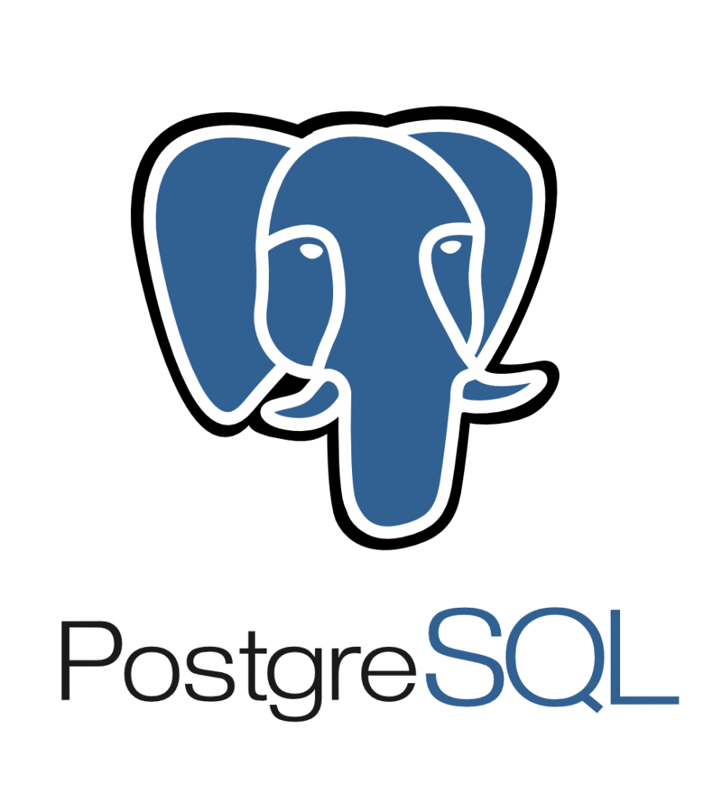

### Hi there 👋! I'm Stas.

### About me

- 💻 I'm full stack developer . I studied Pytnon, JS, Django, React, Vue.js.
- 📚 
- 🌍 I love to travel and visit new, interesting places.
- 🤩 I'm like write code.
- 🤔 I am constantly striving for development.

### Connect with me:

[][telegram]
[][linkedin]

 

### Languages and Tools:

 
 
 

 

[telegram]: https://t.me/pepperhotmsk
[linkedin]: https://www.linkedin.com/in/stanislav-ocunev-203106238/
