### Hi there 👋! I'm Stas.

### About me

- 💻 I'm a frontend developer with ambitions to become a fullstack developer.
- 📚 I have a strong passion for continuous learning and staying updated with the latest technologies and industry trends.
- 🌍 Besides coding, I love traveling and exploring new destinations to immerse myself in different cultures and gain inspiration.
- 🤩 I find joy in writing code and turning ideas into functional software solutions.
- 🤔 With a growth mindset, I am constantly pushing myself to grow both personally and professionally through feedback, collaboration, and new challenges.

### Connect with me:

 
 

 

### Frontend:

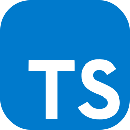

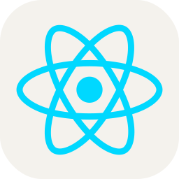
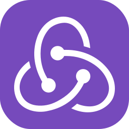

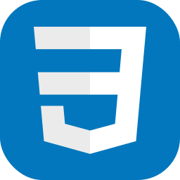
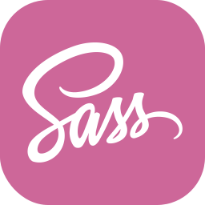
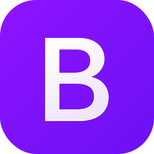

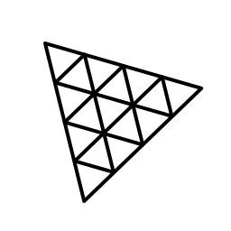

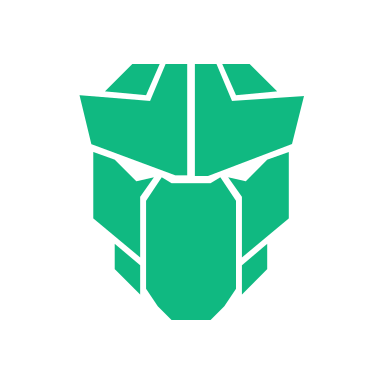

 
 

---
### Backend:

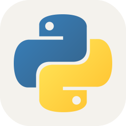
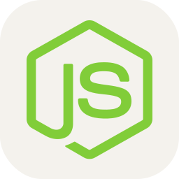

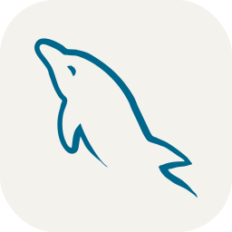

 
 

---
### Other tools:

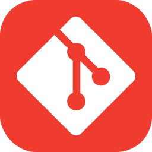
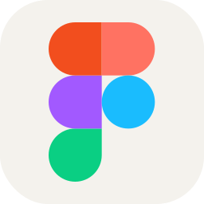
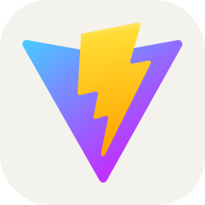
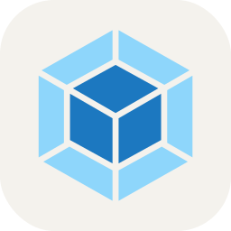

<!-- [telegram]: https://t.me/pepperhotmsk
[linkedin]: https://www.linkedin.com/in/stanislav-ocunev-203106238/ -->
