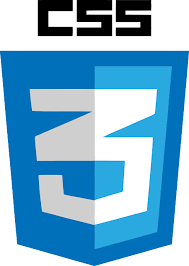

### Hi there 👋! I'm Stas.

### About me

- 💻 I'm a Backend Developer . I studied Pytnon and the Django framework.
- 📚 I'm currently learning JavaScript and React framework.
- 🌍 I love to travel and visit new, interesting places.
- 🤩 I'm like write code and want to be Full Stack Developer.
- 🤔 I’m looking for an internship to gain experience

### Connect with me:

[][telegram]
[][linkedin]

 

### Languages and Tools:

 

[telegram]: https://t.me/pepperhotmsk
[linkedin]: https://www.linkedin.com/in/stanislav-ocunev-203106238/
