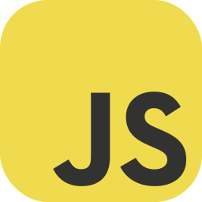

### Hi there 👋! I'm Stas.

### About me

- 💻As a full stack developer, I have experience with Python, JavaScript, Django, React, Vue.js, Nuxt.js  enabling me to work on a wide range of projects and tackle both frontend and backend development tasks.
- 📚 I have a strong passion for continuous learning and staying updated with the latest technologies and industry trends. I actively seek out new opportunities to expand my knowledge and skills in the field of software development.
- 🌍Besides coding, I have a love for traveling and exploring new, captivating destinations. It allows me to immerse myself in different cultures, broaden my horizons, and gain inspiration from diverse experiences.
- 🤩  I find immense joy in the process of writing code and turning ideas into functional and efficient software solutions. Solving complex problems and building innovative applications are among my favorite challenges.
- 🤔 🤔 With a growth mindset, I am constantly pushing myself to grow and improve both personally and professionally. I actively seek feedback, engage in collaborative projects, and embrace new challenges to refine my skills and achieve new milestones.

### Connect with me:

[][telegram]
[][linkedin]

 

### Frontend:

 
 

### Backend:

 
 

### Other tools:

[telegram]: https://t.me/pepperhotmsk
[linkedin]: https://www.linkedin.com/in/stanislav-ocunev-203106238/
